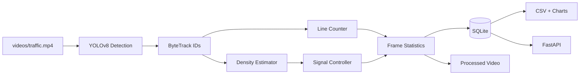

# VisionTrafficAI

**Intelligent Traffic Density Estimation and Adaptive Signal Control**

VisionTrafficAI is a production-oriented computer vision pipeline that detects and tracks road vehicles, counts virtual-line crossings, estimates live traffic density, and recommends adaptive green-signal durations. It stores frame-level telemetry in SQLite, exports analytical reports, produces annotated video, and exposes statistics through FastAPI.

## Highlights

- YOLOv8 detection for cars, buses, trucks, motorcycles, and bicycles
- ByteTrack multi-object tracking with stable vehicle IDs
- Direction-independent virtual-line crossing counts
- Configurable LOW / MEDIUM / HIGH density policy
- Adaptive 20 / 40 / 60-second green signal recommendations
- Annotated MP4 output with boxes, confidence, identity, and dashboard
- Frame-level SQLite persistence, CSV export, and three PNG charts
- Typed FastAPI endpoints with generated OpenAPI documentation
- Modular OOP design, structured logging, error handling, and pytest coverage
- Windows-compatible `pathlib` paths and headless chart generation

## Architecture



The domain policies are independent from OpenCV and YOLO, which keeps density, signal, and counting behavior fast to test and easy to replace. See [the architecture notes](docs/architecture.md) for more detail.

## Requirements

- Python 3.12 or newer
- Windows, Linux, or macOS
- Internet access on the first run if `yolov8n.pt` is not already in `models/`
- Optional NVIDIA CUDA environment supported automatically by PyTorch/Ultralytics

## Installation

```powershell
cd VisionTrafficAI
python -m venv .venv
.venv\Scripts\Activate.ps1
python -m pip install --upgrade pip
pip install -r requirements.txt
```

On Linux or macOS, activate the environment with `source .venv/bin/activate`.

## Run video processing

Place a traffic video at `videos/traffic.mp4`, then run:

```powershell
python main.py
```

Use another source or show the live processing window:

```powershell
python main.py --video C:\path\to\traffic.mp4 --display
```

Press `q` to stop a displayed run. Without `--display`, processing works on headless machines. The first inference may download the lightweight `yolov8n.pt` weights. To avoid a download, place that file in `models/`.

Generated artifacts:

- `outputs/processed_traffic.mp4`
- `outputs/traffic_report.csv`
- `outputs/charts/vehicle_count_over_time.png`
- `outputs/charts/density_distribution.png`
- `outputs/charts/vehicle_type_distribution.png`
- `outputs/vision_traffic_ai.log`
- `data/traffic_stats.db`

## Run the API

The API can run before or after video processing. Before data exists, `/stats` returns `null` and `/history` returns an empty list.

```powershell
uvicorn api.main:app --host 0.0.0.0 --port 8000
```

Endpoints:

| Method | Endpoint | Description |
|---|---|---|
| GET | `/health` | Service readiness |
| GET | `/stats` | Latest frame statistics |
| GET | `/history?limit=500&offset=0` | Paginated database history |
| GET | `/docs` | Interactive OpenAPI documentation |

## Configuration

All defaults live in `app/config.py` in the immutable `Settings` model, including model name, confidence and IoU thresholds, ByteTrack configuration, counting-line position, density boundaries, signal timing, database path, and output paths. Create an adjusted settings instance with Pydantic's `model_copy(update={...})` when embedding the processor in another application.

Default density policy:

| Visible supported vehicles | Density | Green time |
|---:|---|---:|
| 0–5 | LOW | 20 seconds |
| 6–15 | MEDIUM | 40 seconds |
| 16+ | HIGH | 60 seconds |

Motorcycles and bicycles are normalized into the **Bikes** crossing category. Density uses currently visible supported vehicles; category totals count unique tracked vehicles crossing the line.

## Tests

```powershell
pytest
```

Tests cover boundary conditions for density estimation, signal policy validation, class normalization, missing tracker identities, and count-once crossing behavior.

## Folder structure

```text
VisionTrafficAI/
├── app/
│   ├── analytics.py
│   ├── config.py
│   ├── counter.py
│   ├── database.py
│   ├── density.py
│   ├── detector.py
│   ├── processor.py
│   ├── signal_controller.py
│   ├── tracker.py
│   └── utils.py
├── api/main.py
├── data/
├── docs/architecture.md
├── models/
├── outputs/
├── tests/
├── videos/
├── main.py
├── pytest.ini
├── requirements.txt
└── README.md
```

## Screenshots

| Annotated traffic stream | Analytics dashboard |
|---|---|
| _Add `docs/processed-video.png` after running a sample_ | _Add `docs/analytics.png` after running a sample_ |

## Operational notes

- If the source video is missing or unreadable, the CLI logs a clear message and exits with a non-zero status.
- Existing database rows are retained between runs. Delete `data/traffic_stats.db` when a clean reporting session is required.
- SQLite is a strong single-node choice. A deployment with multiple processing workers should use PostgreSQL and a migration tool.
- The recommended green duration is advisory; real roadside deployment requires certified hardware, fail-safe controls, jurisdictional approval, and broader intersection state.

## Future improvements

- Camera calibration and homography-based speed estimation
- Lane polygons and per-lane density/control recommendations
- Temporal heatmaps and congestion forecasting
- Emergency-vehicle recognition with a dedicated validated dataset
- Direction-specific counts and wrong-way detection
- Batched database writes and asynchronous processing for high-throughput streams
- RTSP ingestion, reconnect policy, metrics, background service daemons, and GPU deployment
- Multi-camera coordination and reinforcement-learning signal optimization


