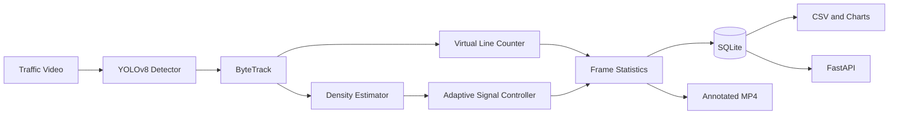

# Architecture

VisionTrafficAI uses a layered pipeline so inference, domain policy, persistence, presentation, and delivery remain independently testable.

## Design decisions

- YOLO is loaded lazily, so the REST API does not need model weights or GPU initialization.
- Ultralytics ByteTrack supplies stable identities while `VehicleCounter` owns counting policy.
- Density means the number of supported vehicles visible in the current frame; type counts are cumulative line crossings.
- SQLite connections are short-lived and parameterized, making CLI and API access safe across threads.
- Configuration is immutable and centralized in `app/config.py`.
